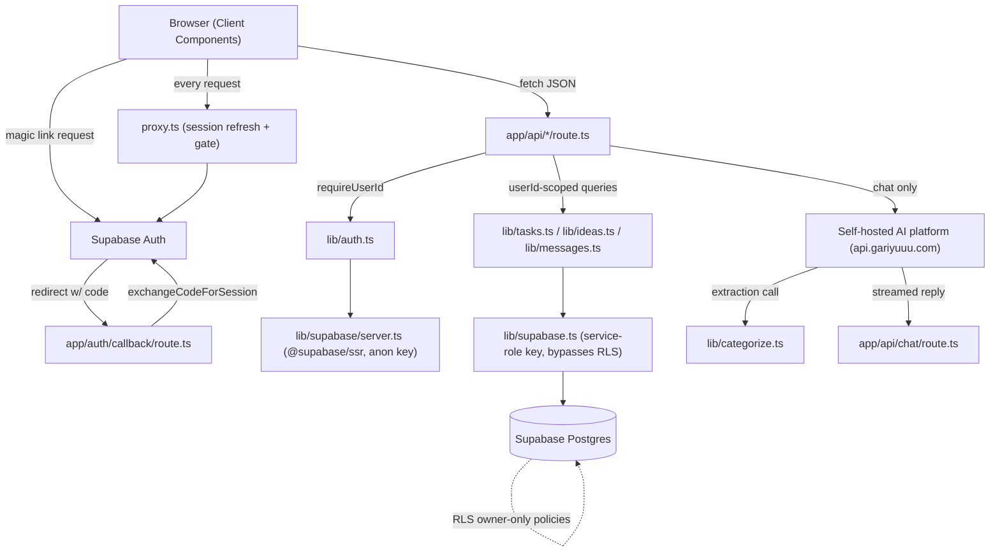

# ARCHITECTURE.md

Technical architecture reference for Nodability. All facts Verified from source unless marked
Inferred. See [CLAUDE.md](CLAUDE.md) for the condensed version and [FILE_MAP.md](FILE_MAP.md)
for a file-by-file index.

## System overview

Nodability is a single Next.js 16 App Router application. Every page **except
`app/changelog/page.tsx`** is a Client Component that fetches its own data from a small set of
JSON API routes on mount. `app/changelog/page.tsx` is the one Server Component page in the
app — it has no `"use client"` directive and renders `lib/changelog.ts`'s static exported
array directly at render time (not a database fetch, just an imported constant). There is no
database-backed server-rendered data fetching anywhere (no RSC data fetches from Supabase, no
`getServerSideProps`). The only server-side compute paths are the API routes under
`app/api/*`, one auth callback route, one Server Action (`signOutAction`), and the
request-level `proxy.ts`.

## Frontend structure

- **App Router pages** (`app/*/page.tsx`): each is `"use client"`, holds its own `useState`/
  `useEffect` data-fetch logic, and renders a mix of shared and page-specific components.
- **Shared components** (`components/*.tsx`, `components/calendar/*`, `components/theme/*`):
  presentational + light state, receive callbacks from their parent page rather than fetching
  independently (exception: `Sidebar.tsx` fetches its own `/api/categories`).
- **No routing library** beyond Next.js's file-based App Router. Navigation is plain
  `next/link` `<Link>` components; no dynamic route segments exist anywhere in this app (every
  route is a static path).
- **Rendering strategy:** Static rendering for pages/assets with no per-request data
  dependency (`/icon`, `/apple-icon`, `/changelog`); every page that needs auth-gated data is
  effectively client-rendered after a client-side fetch (so there's a brief "Loading…" state
  on every page load — see each page's `loading` state).

## Backend structure

- **API routes** (`app/api/{tasks,ideas,categories,templates,chat}/route.ts`): thin HTTP
  handlers. Each (except chat) follows: `requireUserId()` → parse/validate body → call a
  `lib/*.ts` function → `NextResponse.json(...)`.
- **Auth callback** (`app/auth/callback/route.ts`): exchanges a magic-link PKCE `code` query
  param for a session, redirecting to `/` on success or `/login?error=...` on failure.
- **Server Action** (`lib/actions.ts:signOutAction`): the only Server Action in the app, wired
  to a plain `<form action={signOutAction}>` in `app/page.tsx`.
- **Data-access layer** (`lib/tasks.ts`, `lib/ideas.ts`, `lib/messages.ts`): every exported
  function takes `userId` as its first parameter and uses the service-role Supabase client
  (`lib/supabase.ts`). This is the actual authorization boundary — see
  [Server/client boundaries](#serverclient-boundaries) below.
- **AI layer** (`lib/ai-client.ts`, `lib/categorize.ts`, `lib/prompts.ts`): wraps the `openai`
  npm package pointed at a self-hosted, OpenAI-compatible platform (see `DECISIONS.md`
  DEC-013 — this replaced a direct Anthropic SDK integration as of commit `b4fb289`);
  `lib/categorize.ts:extractTasks()` is the only place a forced tool-use call is made.

## Server/client boundaries

- `lib/supabase.ts` (service-role client) is imported **only** by `lib/tasks.ts`,
  `lib/ideas.ts`, `lib/messages.ts`, and `scripts/create-users.mjs` — all server-only contexts.
  It must never be imported by a `"use client"` file (would bundle the service-role key into
  client JS).
- `lib/supabase/server.ts` (session-aware, anon key, cookie-bound via `@supabase/ssr`) is used
  by `lib/auth.ts`, `lib/actions.ts`, and `app/auth/callback/route.ts` — anywhere the app needs
  to know *who is signed in*, as opposed to querying data.
- `lib/supabase/browser.ts` (session-aware, anon key, browser storage) is used only by
  `app/login/page.tsx` to call `signInWithOtp` client-side.
- `proxy.ts` runs on the edge/middleware layer for every matched request (see its `matcher`
  config) — it never touches `lib/supabase.ts`.

## Request lifecycle (typical authenticated page load)

1. Browser requests `/` (or any protected route).
2. `proxy.ts` runs: builds a session-aware Supabase client from request cookies, calls
   `supabase.auth.getUser()`. If no user and the path isn't public, redirects to
   `/login?next=<path>`. If there is a user, forwards the request (refreshing the session
   cookie via `setAll` if Supabase rotated it).
3. Next.js serves the static shell of `app/page.tsx` (a Client Component — no server data
   fetch happens here).
4. On mount, the page's `useEffect` fires `fetch("/api/tasks")` (and similar for categories,
   ideas, etc. depending on the page).
5. The API route independently calls `requireUserId()` (via `lib/auth.ts`, using
   `lib/supabase/server.ts`) — this is a **second, independent auth check**, not reused from
   step 2. If it fails, the route returns 401 JSON (not a redirect — deliberately, so a
   `fetch()` caller gets parseable JSON instead of an HTML redirect body).
6. The route calls the relevant `lib/tasks.ts`/etc. function with the resolved `userId`,
   which queries Postgres via the **service-role** client (bypassing RLS, relying on the
   explicit `.eq("user_id", userId)` filter).
7. Response flows back as JSON; the page's `useState` updates and re-renders.

## Data flow (chat message → task creation)

1. `ChatPanel.tsx` posts `{ message }` to `POST /api/chat`.
2. Route calls `requireUserId()`.
3. Route fetches `listCategories(userId)` and `listRecentMessages(userId, 20)` in parallel.
4. Route calls `lib/categorize.ts:extractTasks(message, categoryNames, history)` — this makes
   a **separate, forced tool-use** call against the self-hosted AI platform (`EXTRACTION_MODEL`
   from `lib/ai-client.ts`), asking it to return a structured `extract_tasks` tool call (new
   tasks, categories, deletions, and whether the message is a "recall query"). Throws if the
   model doesn't return the expected tool call shape.
5. For each extracted task: `getOrCreateCategory(userId, name)` then `insertTask(userId, ...)`.
   For each deletion: `deleteCategoryByName` / `deleteTaskByTitle`.
6. Route re-fetches `listTasks(userId)`, filters to `status === "open"`, and builds a
   plain-text "context block" describing every open task plus an "Actions just taken" log of
   what this turn actually did.
7. Route calls `aiClient.chat.completions.create({ stream: true, ... })` (`lib/ai-client.ts`,
   `CHAT_MODEL`) with the persona system prompt (`buildSystemPrompt(personality)`), the recent
   conversation history, and a final user turn containing today's date + the context block +
   the actions log + the raw user message.
8. The stream (`for await (const chunk of stream)`, reading
   `chunk.choices[0]?.delta?.content`) is piped straight to the HTTP response as `text/plain`
   chunks.
9. On stream completion, both the user's message and the full assistant reply are persisted
   via `insertMessage(userId, ...)` — **note:** if the stream errors mid-flight, these two
   `insertMessage` calls are skipped, so that turn is never saved to chat history (a known edge
   case, see `CLAUDE.md` ISSUE-002).

## Authentication flow

See [SECURITY.md](SECURITY.md) for the full write-up. Summary: magic link (PKCE) →
`signInWithOtp({ shouldCreateUser: false })` → email → `/auth/callback?code=...` →
`exchangeCodeForSession` → session cookie set → `proxy.ts` gates all subsequent requests →
every API route independently re-verifies via `requireUserId()`.

## Authorization flow

Two layers, by design:

1. **RLS policies** (`user_id = auth.uid()` on all 4 tables) — would apply if any code ever
   queried with the anon/session-aware client. Currently **not the active enforcement path**
   for the app itself.
2. **Application-level filtering** — every `lib/tasks.ts`/`lib/ideas.ts`/`lib/messages.ts`
   function takes `userId` and adds `.eq("user_id", userId)` to every query. **This is the
   real authorization boundary today**, because all server code uses the service-role client.

## Database access flow

Single path: API route → `lib/{tasks,ideas,messages}.ts` function (passed `userId`) →
`lib/supabase.ts` service-role client → Supabase Postgres REST layer. No connection pooling
concerns to manage (Supabase's REST/PostgREST layer handles this). No ORM, no query builder
abstraction beyond `supabase-js`'s own `.from().select()...` chain.

## Storage flow

One Supabase Storage bucket, `theme-uploads` (public-read, created by migration `007`).
Flow: browser file input → `POST /api/theme-image` (multipart form data) → route validates
auth/type/size → uploads via the **service-role** client (bypasses Storage RLS entirely,
same trust model as every DB write in this app) → returns the bucket's public URL → client
stores that URL in `localStorage` and applies it as an inline CSS custom property
(`ThemeProvider.tsx`). The 10 curated theme photos are **not** in this bucket — they're
static files in `public/theme/`, served by Next.js directly, no Storage/DB involvement.

## External API integration flow

- **AI platform:** `lib/ai-client.ts` constructs one `openai`-package client from
  `AI_PLATFORM_API_KEY`, pointed at `https://api.gariyuuu.com/v1`, used by both
  `lib/categorize.ts` (`EXTRACTION_MODEL`, non-streaming, forced tool-use) and
  `app/api/chat/route.ts` (`CHAT_MODEL`, streaming). No retry/backoff logic exists for either
  call. Replaced a direct Anthropic SDK client as of commit `b4fb289` — see `DECISIONS.md`
  DEC-013.
- **Supabase:** three different client constructions for three different trust levels — see
  [Server/client boundaries](#serverclient-boundaries).
- **Unsplash:** not an "integration" in the API sense — just hotlinked CDN image URLs baked
  into `app/globals.css`. No API key, no rate limit concerns beyond Unsplash's own CDN terms.

## Real-time communication / multiplayer

None. This is not a multiplayer or real-time-collaborative app — there is no WebSocket,
Supabase Realtime subscription, or polling mechanism. If the two users are both viewing the
board simultaneously, neither sees the other's changes until they manually reload or trigger
a refetch (e.g. by toggling a task, which bumps `refreshKey` locally but does not broadcast to
other sessions).

## Background / scheduled jobs

None exist in this repo.

## Caching

No explicit application-level caching (no `revalidate`, no `unstable_cache`, no external
cache like Redis). Next.js's build-time static optimization applies automatically to routes
with no per-request dependency (see the `○ (Static)` vs `ƒ (Dynamic)` markers in `npm run
build`'s output).

## State management

Local component state only (`useState`, `useEffect`). The only cross-component shared state
is theme (`components/theme/ThemeProvider.tsx`, via React Context) — there is no global store
for task/category/message data; each page independently fetches and holds its own copy.

## Error handling

Inconsistent by design-vs-actual: the CRUD API routes (`tasks`, `ideas`, `categories`,
`templates`) all follow the same try/catch → `UnauthorizedError` → 401 JSON pattern. The chat
route does not extend this pattern past the initial auth check (see `CLAUDE.md` ISSUE-002).
Client-side, most fetches are fire-and-forget (`await fetch(...)` with no `.ok` check) except
where a JSON body is read back (e.g. idea creation, template application).

## Logging

No structured logging or log aggregation. Within the deployed Next.js app itself, the only
`console.*` call is `console.error` in `app/auth/callback/route.ts:15`, logging magic-link
exchange failures to the Vercel function log. (Separately, the standalone CLI script
`scripts/create-users.mjs` also uses `console.log`/`console.error` for its own terminal
output when run locally — expected for a CLI tool, not part of the running application's
logging.)

## Analytics

None implemented.

## Deployment architecture

Single Vercel project, no separate staging environment, no `vercel.json` (all defaults).
Production and Preview deployments share the *same* Supabase project (there is no
separate dev/staging database) — see `CLAUDE.md`'s Deployment section and
[DEPLOYMENT.md](DEPLOYMENT.md) for the full checklist and the risk this implies.

## Scaling considerations (Inferred — not a concern the repo shows evidence of addressing)

- No connection pooling configuration beyond Supabase's own defaults.
- No pagination on any list endpoint (`listTasks`, `listRecentMessages` uses a hard `limit`,
  `listIdeas`, `listCategories` all return unbounded/lightly-bounded result sets) — fine at
  current scale (dozens of rows), would need revisiting well before hundreds/thousands.
- No rate limiting anywhere — a scripted/abusive client could run up AI-platform costs
  quickly since `/api/chat` has no per-user or per-IP throttling.

## Security boundaries

See [SECURITY.md](SECURITY.md) for the full review. The core boundary is: **service-role
client + explicit `userId` filtering in every query function**, backed by RLS as a second
layer that would only matter if a future code path used the anon/session client for data
queries instead.

## Major architectural risks

1. **Single point of enforcement:** because RLS is not the active boundary, a single missed
   `.eq("user_id", userId)` in any new `lib/*.ts` function would leak cross-user data with no
   database-level backstop catching it in practice (the RLS policy exists but the service-role
   key ignores it).
2. **No staging environment:** Preview deployments on Vercel point at the same production
   Supabase project — there is no isolated environment to test schema changes against before
   they hit real data.
3. ~~**Chat route fragility**~~ — **Fixed.** `/api/chat` now catches failures and returns a
   clean error response (see `CLAUDE.md` ISSUE-002).
4. ~~**External image dependency**~~ — **Fixed.** Theme background photos are self-hosted in
   `public/theme/` rather than depending on Unsplash CDN URLs staying live (see `CLAUDE.md`
   ISSUE-004).
5. **`next` is pinned behind 3 known-vulnerable transitive dependencies:** `postcss`/`sharp`
   (via `next`) have open high-severity advisories; fixing them requires a `next` version
   bump past the pinned `16.2.11`, deliberately deferred pending a dedicated review pass (see
   `SECURITY.md`, `CLAUDE.md` ISSUE-006).
