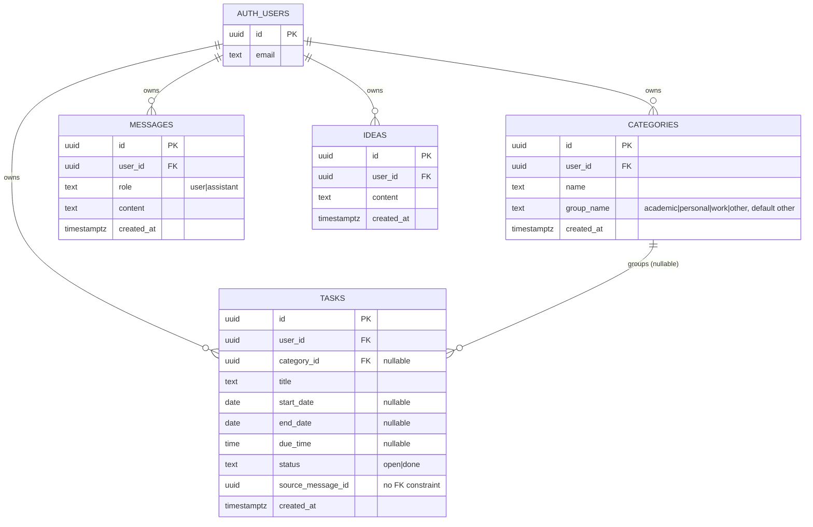

# DATABASE.md

- **Provider:** Supabase (managed Postgres), project ref `hwvqnenmnrzdncwznorv`
  (`NEXT_PUBLIC_SUPABASE_URL=https://hwvqnenmnrzdncwznorv.supabase.co`).
- **Schema source:** `supabase/schema.sql` (base) + `supabase/migrations/002_date_range_and_time.sql`,
  `003_ideas.sql`, `004_user_scoping.sql`, `005_category_group.sql`, applied **manually, in
  numeric order**, by pasting into the Supabase SQL Editor. There is no Supabase CLI
  (`supabase/config.toml` does not exist), no automated migration runner, and no `down`
  migrations — this is forward-only.
- **Live row counts at audit time (2026-08-06):** `tasks` 19, `messages` 112, `ideas` 7,
  `categories` 3. **This is real production data belonging to 2 real people.**

## ⚠️ Known inconsistency: `schema.sql` does not replay cleanly against the migrations

`supabase/schema.sql` already contains `start_date`/`end_date`/`due_time` columns on `tasks`
directly — but `002_date_range_and_time.sql` is written as if starting from a schema that has
a single `due_date` column (it does `update tasks set start_date = due_date, end_date =
due_date where due_date is not null` then `drop column if exists due_date`). This means
**`schema.sql` was edited after the fact to reflect the post-`002` shape**, rather than
staying a true "before `002`" snapshot. Running `schema.sql` fresh today, then `002`, would
execute the `update ... where due_date is not null` line against a table that never had a
`due_date` column — Postgres would error (`column "due_date" does not exist`) since the
`where` clause references a nonexistent column. **This means the migration set is not
actually replayable from scratch as ordered.** In practice this doesn't matter for the *live*
database (it was migrated incrementally, in the order the columns were actually added, not by
replaying from `schema.sql`), but it matters for anyone trying to spin up a *new* Supabase
project from these files — they would need to skip `002`'s `due_date`-migration lines (or
run `schema.sql` alone, which already has the right shape, then skip straight to `003`).

## Tables

### `categories`
| Column | Type | Constraints | Added in |
|---|---|---|---|
| `id` | uuid | PK, default `gen_random_uuid()` | schema.sql |
| `name` | text | not null | schema.sql (originally globally `unique`, see below) |
| `created_at` | timestamptz | not null, default `now()` | schema.sql |
| `user_id` | uuid | not null, FK → `auth.users(id)` | `004` |
| `group_name` | text | not null, default `'other'`, CHECK in `('academic','personal','work','other')` | `005` |

- **Indexes:** `categories_user_id_idx(user_id)` (`004`);
  `categories_user_id_name_key` — **unique** on `(user_id, name)` (`004`, replacing the
  original global-unique constraint on `name` alone, which `004` drops).
- **Known risk:** the unique index is **case-sensitive**, but application code
  (`lib/tasks.ts:getOrCreateCategory`) looks up existing categories case-insensitively via
  `.ilike()` before deciding whether to insert. A race condition or a manually-inserted row
  could create two rows differing only by case (e.g. `"Chemistry"` and `"chemistry"`) that the
  unique index would not catch. Not observed in production data at audit time (3 categories,
  no case collisions).
- **RLS:** Enabled (`004`). Policy `categories_owner`: `for all using (user_id = auth.uid())
  with check (user_id = auth.uid())`.

### `tasks`
| Column | Type | Constraints | Added in |
|---|---|---|---|
| `id` | uuid | PK, default `gen_random_uuid()` | schema.sql |
| `title` | text | not null | schema.sql |
| `category_id` | uuid | FK → `categories(id)`, nullable, **no ON DELETE clause** (defaults to `NO ACTION` — deleting a category that still has tasks referencing it will fail at the DB level; app code avoids this via `deleteCategoryIfEmpty`) | schema.sql |
| `start_date` | date | nullable | schema.sql |
| `end_date` | date | nullable | schema.sql |
| `due_time` | time | nullable | schema.sql |
| `status` | text | not null, default `'open'`, CHECK in `('open','done')` | schema.sql |
| `source_message_id` | uuid | nullable, **no FK constraint** — not linked to `messages.id` at the DB level despite the name | schema.sql |
| `created_at` | timestamptz | not null, default `now()` | schema.sql |
| `user_id` | uuid | not null, FK → `auth.users(id)`, **no ON DELETE clause** | `004` |

- **Indexes:** `tasks_category_id_idx(category_id)`, `tasks_start_date_idx(start_date)`
  (declared twice, harmless — both `schema.sql` and `002` create it with `if not exists`),
  `tasks_status_idx(status)`, `tasks_user_id_idx(user_id)` (`004`).
- **RLS:** Enabled (`004`). Policy `tasks_owner`, same owner-only shape as `categories_owner`.

### `messages`
| Column | Type | Constraints | Added in |
|---|---|---|---|
| `id` | uuid | PK, default `gen_random_uuid()` | schema.sql |
| `role` | text | not null, CHECK in `('user','assistant')` | schema.sql |
| `content` | text | not null | schema.sql |
| `created_at` | timestamptz | not null, default `now()` | schema.sql |
| `user_id` | uuid | not null, FK → `auth.users(id)` | `004` |

- **Indexes:** `messages_created_at_idx(created_at)`, `messages_user_id_idx(user_id)` (`004`).
- **RLS:** Enabled (`004`). Policy `messages_owner`.
- **Purpose:** Full chat transcript (both user and assistant turns), used to build
  conversation-history context for the next chat turn (`lib/messages.ts:listRecentMessages`,
  capped at the last 20 by the caller in `app/api/chat/route.ts`).

### `ideas`
| Column | Type | Constraints | Added in |
|---|---|---|---|
| `id` | uuid | PK, default `gen_random_uuid()` | `003` |
| `content` | text | not null | `003` |
| `created_at` | timestamptz | not null, default `now()` | `003` |
| `user_id` | uuid | not null, FK → `auth.users(id)` | `004` |

- **Indexes:** `ideas_created_at_idx(created_at)`, `ideas_user_id_idx(user_id)` (`004`).
- **RLS:** Enabled (`004`). Policy `ideas_owner`.

### `auth.users` (Supabase-managed, not defined in this repo's SQL)
Referenced by every table's `user_id` FK. Managed entirely by Supabase Auth. New rows are
created only via `scripts/create-users.mjs` (admin API, no self-serve signup — see
`SECURITY.md`). **2 rows exist** at audit time: the app owner's account and their partner's
account. (Real email addresses intentionally omitted from this doc — this repo is pushed to
a public GitHub remote; see `scripts/create-users.mjs` usage comment for how to look up or
add accounts, and query `auth.users` directly in the Supabase dashboard if you need the
actual addresses.)

## Entity-relationship diagram

## Access patterns

- Every read/write goes through `lib/tasks.ts` / `lib/ideas.ts` / `lib/messages.ts`, using the
  **service-role** client (`lib/supabase.ts`) — RLS is not the active enforcement layer for
  the app itself (see `ARCHITECTURE.md` and `SECURITY.md`).
- Category lookup by name is case-insensitive at the application layer (`.ilike()`) but
  case-sensitive at the DB-constraint layer (see the known risk under `categories` above).
- No pagination on any query — `listTasks`, `listIdeas` fetch unbounded result sets per user;
  `listRecentMessages` is capped by an explicit `.limit(20)` call from
  `app/api/chat/route.ts`.

## Ownership model

Strict single-owner: every row belongs to exactly one `user_id`, no shared/team rows, no
concept of a row visible to both accounts. There is no `profiles` table and no per-user
settings table — theme preference, for example, lives only in browser `localStorage`, not in
the database.

## Deletion / cascading behavior

**No `ON DELETE CASCADE` is configured anywhere.** Concretely:
- Deleting an `auth.users` row (a whole account) would be **blocked** by Postgres if that user
  has any rows in `categories`/`tasks`/`messages`/`ideas`, since none of those FKs specify a
  delete behavior (default `NO ACTION`). There is no account-deletion flow in the app or a
  script for it.
- Deleting a `categories` row that still has `tasks` pointing at it via `category_id` is
  similarly blocked at the DB level — the app avoids ever attempting this via
  `lib/tasks.ts:deleteCategoryIfEmpty`, which only deletes a category once its task count
  reaches 0.

## Retention

No retention/archival policy exists — all data (including old `messages` rows) accumulates
indefinitely. 112 message rows already exist for what is a fairly young project; this will
grow unbounded without any pruning logic.

## Storage buckets

None — no Supabase Storage is used anywhere in this app.

## Generated types

None — there is no `supabase gen types` workflow. All row shapes are hand-written TypeScript
interfaces (`Category`, `Task`, `Message`, `Idea`) in `lib/tasks.ts` / `lib/ideas.ts` /
`lib/messages.ts`. If the schema changes, these interfaces must be updated by hand and kept in
sync — there's no compiler-enforced link between the SQL and the TypeScript types.

## Sensitive data

No specially sensitive personal data is stored beyond task/message/idea free-text content
(which could contain anything the two users type) and their email addresses (managed by
Supabase Auth, not stored redundantly in any app table). No payment data, no health data
schema, no SSNs, etc.

## Migration risks

- **`004_user_scoping.sql` must run in its documented two-pass order** with a manual backfill
  step in between (see the comment block at the top of that file). Running it as a single
  paste will fail: Pass 2's `set not null` on `user_id` will reject any row where the
  Pass-1-added nullable column was never backfilled.
- **Never re-run an already-applied migration file** — several use `add column if not
  exists` / `create index if not exists` (safe to re-run), but `004`'s `alter column ...
  set not null` and RLS policy creation (`create policy ...`, no `if not exists` guard for
  policies) are **not** safely re-runnable — re-running the policy-creation lines against a
  database that already has those policies will error with "policy already exists."
- See the ⚠️ known inconsistency section above regarding `schema.sql` vs. `002` for anyone
  provisioning a brand-new Supabase project from these files.
